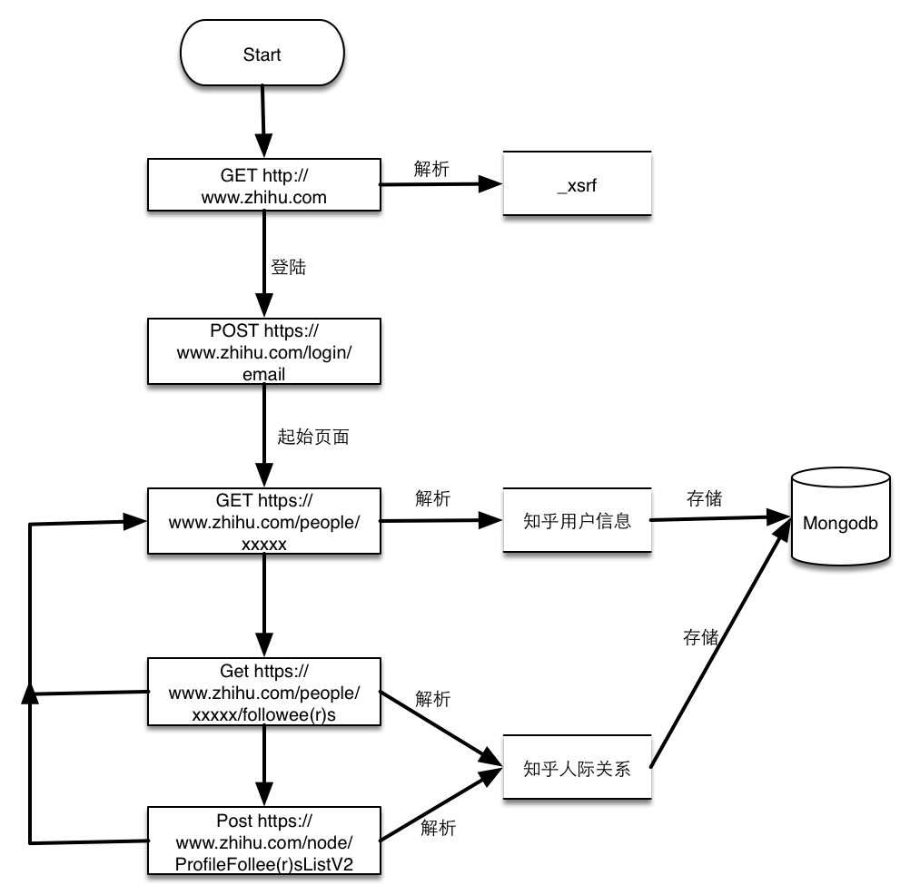
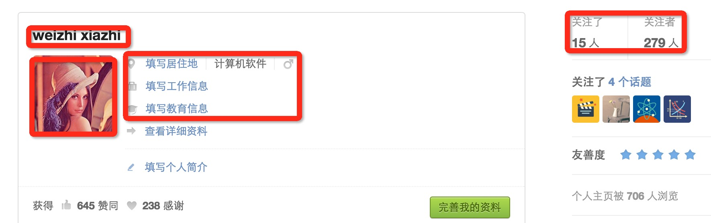
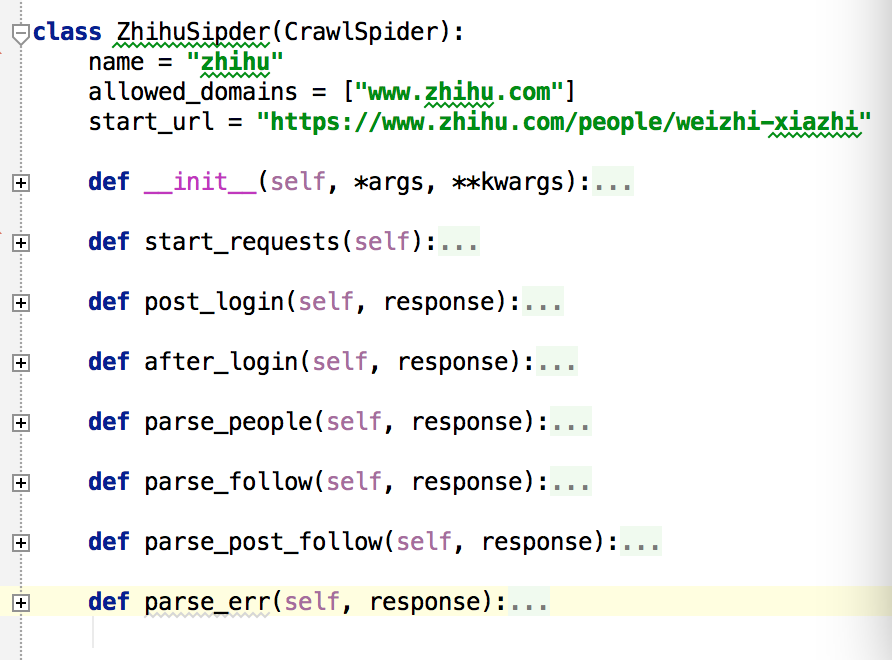
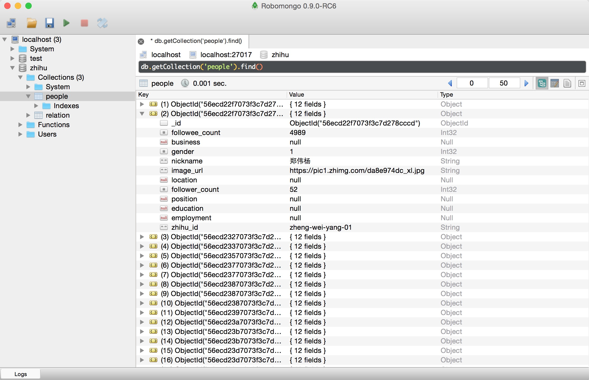
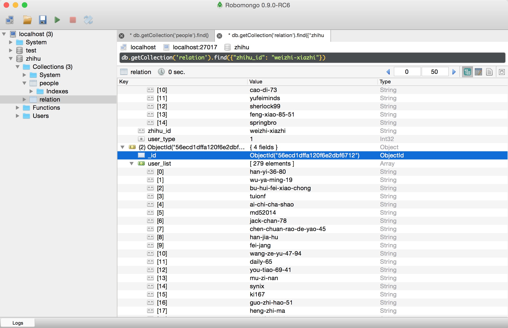
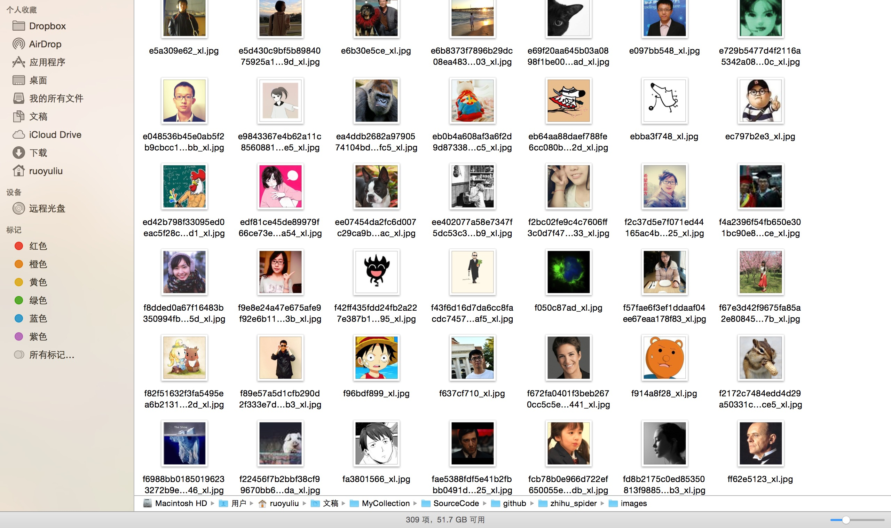

# zhihu_spider

此项目的功能是爬取知乎用户信息以及人际拓扑关系，爬虫框架使用scrapy，数据存储使用mongo，下载这些数据感觉也没什么用，就当为大家学习scrapy提供一个例子吧。

## 使用方法

### 本地运行

爬虫程序依赖mongo和rabbitmq，因此这两个服务必须正常运行和配置。为了加快下载效率，图片下载是异步任务，因此在启动爬虫进程执行需要启动异步worker，启动方式是进入zhihu_spider/zhihu目录后执行下面命令:

```
celery -A zhihu.tools.async worker --loglevel=info
```

### docker部署

进入zhihu_spider后执行```docker-compose up``` ，进入container后和本地运行方法相同，依次启动mongo、rabbitmq、异步任务、爬虫进程即可。docker采用的image可以参见我的另一个项目[spider-docker](https://github.com/LiuRoy/spider_docker)获取。

## 流程图



* 请求[https://www.zhihu.com](https://www.zhihu.com)获取页面中的_xsrf数据，知乎开启了跨站请求伪造功能，所有的POST请求都必须带上此参数。
* 提交用户名，密码已经第一步解析的_xsrf参数到[https://www.zhihu.com/login/email](https://www.zhihu.com/login/email)，登陆获取cookies
* 访问用户主页，以我的主页为例[https://www.zhihu.com/people/weizhi-xiazhi](https://www.zhihu.com/people/weizhi-xiazhi)， 如下图：

解析的用户信息包括昵称，头像链接，个人基本信息还有关注人的数量和粉丝的数量。这个页面还能获取关注人页面和粉丝页面。
* 由上一步获取的分页列表页面和关注人页面获取用户人际关系，这两个页面类似，唯一麻烦的是得到的静态页面最多只有二十个，获取全部的人员必须通过POST请求，解析到的个人主页再由上一步来解析。

## 代码解释

scrapy文档非常详细，在此我就不详细讲解，你所能碰到的任何疑问都可以在文档中找到解答。


* 爬虫框架从start\_requests开始执行，此部分会提交知乎主页的访问请求给引擎，并设置回调函数为post_login.
* post\_login解析主页获取\_xsrf保存为成员变量中，并提交登陆的POST请求，设置回调函数为after\_login.
* after\_login拿到登陆后的cookie，提交一个start\_url的GET请求给爬虫引擎，设置回调函数parse\_people.
* parse\_people解析个人主页，一次提交关注人和粉丝列表页面到爬虫引擎，回调函数是parse\_follow, 并把解析好的个人数据提交爬虫引擎写入mongo。
* parse\_follow会解析用户列表，同时把动态的人员列表POST请求发送只引擎，回调函数是parse\_post\_follow，把解析好的用户主页链接请求也发送到引擎，人员关系写入mongo。
* parse\_post\_follow单纯解析用户列表，提交用户主页请求至引擎。

## 效果图


