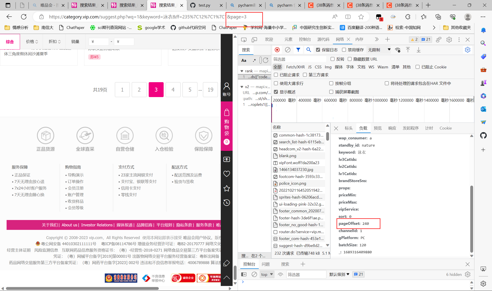

主要有两个参数

    第一个链接所需参数是 pageOffset 用于翻页
    
    第二个链接所需参数是 productIds

    注意递归函数的使用，自己调用自己

知识点

    1.切片
        [0:50]  # 从0开始，到50结束，不包括50
        [50:100]
        [100:120]
    2.
        for j in product['attrs']:
        print(j)
        attr = j['value']
        ','.join(attr)
          等价于                  
        attr = ','.join([j['value'] for j in product['attrs']])  # 商品信息
    3.批量替换 Ctrl + R
        (.*?):(.*)
        '$1':'$2',

        批量删除 Ctrl + D
        批量复制 Ctrl + C
        批量粘贴 Ctrl + V
        批量注释 Ctrl + /
        批量取消注释 Ctrl + /
        批量上移 Ctrl + Shift + ↑
        批量下移 Ctrl + Shift + ↓
    4.递归函数
        def get_page(pageOffset):
            ...
            ...
            get_page(pageOffset)  # 递归调用，自己调用自己


# 单页爬取 只需要’productIds‘这一个参数
首先从第一个链接获取 productIds 的值，将productIds的值传入第二个链接中，获取评论数据


这样就找到该页面所有的商品id（pid）
    
    这第一页共有120个pid


接下来--来到 商品详情页面，注意这一页只有50个商品

    用同样的方法，可以发现，第一页共有120个商品
       用3个页面面（子链接）来存储
       1_1 页存放前50个商品  # 切片获取pid
       1_2页存放中间50个商品
       1-3页存放后20个商品


# 接下来进行翻页
对页面进行翻页，发现翻页的参数是 pageOffset
详细如下：
第一页的参数是 pageOffset=0

第二页的参数是 pageOffset=120
第三页的参数是 pageOffset=240

...

对于每一页的商品id，都是从第一个链接中获取的，所以只需要改变第一个链接中的 pageOffset 的值即可


# 代码实现
```python
def get_page(pageOffset):
    link = f'https://mapi.vip.com/vips-mobile/rest/shopping/pc/search/product/rank?app_name=shop_pc&app_version=4.0&warehouse=VIP_SH&fdc_area_id=103102101&client=pc&mobile_platform=1&province_id=103102&api_key=70f71280d5d547b2a7bb370a529aeea1&user_id=&mars_cid=1689250429110_19a247e6d39524f0b2691fcad2474761&wap_consumer=a&standby_id=nature&keyword=%E6%B3%B3%E8%A1%A3&lv3CatIds=&lv2CatIds=&lv1CatIds=&brandStoreSns=&props=&priceMin=&priceMax=&vipService=&sort=0&pageOffset={pageOffset}&channelId=1&gPlatform=PC&batchSize=120&_=1689316409880'
    ...
    ...
    if page_num > math.floor(page_total / 120):  # math.floor(page_total / 120) 向下取整  # 如果当前页数大于总页数，就停止爬取
        print('爬取完毕')
        sys.exit()  # 退出程序
    else:  # 否则，继续爬取下一页
        pageOffset += 120

        get_page(pageOffset)  # 递归调用


